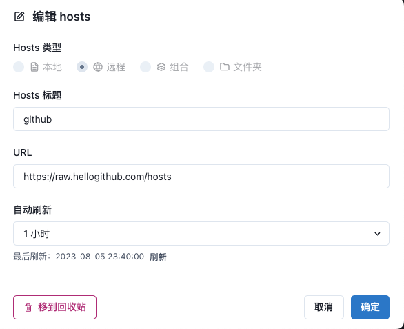
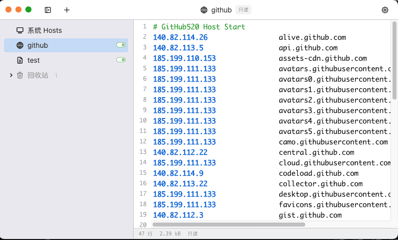

可以方便管理本地hosts，方便本地测试开发，也可解决github访问慢的问题

## 1. 下载 SwitchHosts

- homebrew 下载

```Shell
brew install --cask switchhosts
```

- 从github下载 

[Releases · oldj/SwitchHosts](https://github.com/oldj/SwitchHosts/releases)

## 2. 添加github远程订阅

点击左上角"+" ——> 选择“远程”并如下链接 ——> 点击确定, 可以看到如右图效果

```Plain Text
https://raw.hellogithub.com/hosts
```








