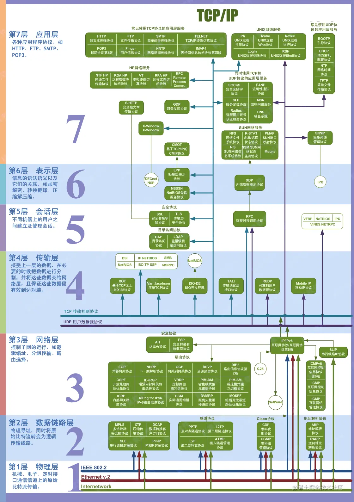
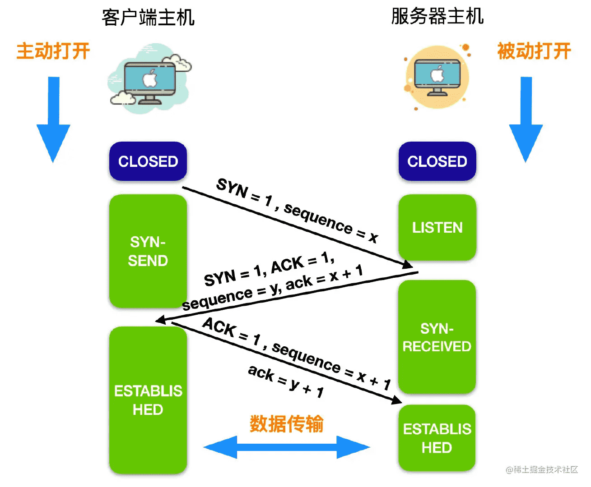

## OSI-七层模型

- 应用层：应用层是 OSI 标准模型的最顶层，是直接为应用进程提供服务的。其作用是在实现多个系统应用进程相互通信的同时，完成一系列业务处理所需的服务。包括文件传输、电子邮件远程登录和远端接口调用等协议。

- 表示层: 表示层向上对应用进程服务，向下接收会话层提供的服务，表示层位于 OSI 标准模型的第六层，表示层的主要作用就是将设备的固有数据格式转换为网络标准传输格式。

- 会话层：会话层位于 OSI 标准模型的第五层，它是建立在传输层之上，利用传输层提供的服务建立和维持会话。

- 传输层：传输层位于 OSI 标准模型的第四层，它在整个 OSI 标准模型中起到了至关重要的作用。传输层涉及到两个节点之间的数据传输，向上层提供可靠的数据传输服务。传输层的服务一般要经历传输连接建立阶段，数据传输阶段，传输连接释放阶段 3 个阶段才算完成一个完整的服务过程。

- 网络层：网络层位于 OSI 标准模型的第三层，它位于传输层和数据链路层的中间，将数据设法从源端经过若干个中间节点传送到另一端，从而向运输层提供最基本的端到端的数据传送服务。

- 数据链路层：数据链路层位于物理层和网络层中间，数据链路层定义了在单个链路上如何传输数据。

- 物理层：物理层是 OSI 标准模型中最低的一层，物理层是整个 OSI 协议的基础，就如同房屋的地基一样，物理层为设备之间的数据通信提供传输媒体及互连设备，为数据传输提供可靠的环境。

## TCP-三次握手，四次挥手

### 三次握手中的状态变化

- LISTEN: 表示等待任何来自远程 TCP 和端口的连接请求。

- SYN-SEND: 表示发送连接请求后等待匹配的连接请求。

- SYN-RECEIVED: 表示已接收并发送连接请求后等待连接确认，也就是 TCP 三次握手中第二步后服务端的状态

- ESTABLISHED: 表示已经连接已经建立，可以将应用数据发送给其他主机

TCP 建立连接时，通过三次握手**能防止历史连接的建立，能减少双方不必要的资源开销，能帮助双方同步初始化序列号**。序列号能够保证数据包不重复、不丢弃和按序传输。**同时第三次握手是可以携带数据的，前两次握手是不可以携带数据的。**

不使用「两次握手」和「四次握手」的原因：

- 「两次握手」：无法防止历史连接的建立，会造成双方资源的浪费，也无法可靠的同步双方序列号；

- 「四次握手」：三次握手就已经理论上最少可靠连接建立，所以不需要使用更多的通信次数。

### 四次挥手的状态变化

- FIN-WAIT-1: 表示等待来自远程 TCP 的连接终止请求，或者等待先前发送的连接终止请求的确认。

- FIN-WAIT-2: 表示等待来自远程 TCP 的连接终止请求。

- CLOSE-WAIT: 表示等待本地用户的连接终止请求。

- CLOSING: 表示等待来自远程 TCP 的连接终止请求确认。

- LAST-ACK: 表示等待先前发送给远程 TCP 的连接终止请求的确认（包括对它的连接终止请求的确认）。

- TIME-WAIT: 表示等待足够的时间以确保远程 TCP 收到其连接终止请求的确认。

- CLOSED: 表示连接已经关闭，无连接状态。

- 关闭连接时，客户端向服务端发送 `FIN` 时，仅仅表示客户端不再发送数据了但是还能接收数据。

- 服务器收到客户端的 `FIN` 报文时，先回一个 `ACK` 应答报文，而服务端可能还有数据需要处理和发送，等服务端不再发送数据时，才发送 `FIN` 报文给客户端来表示同意现在关闭连接。

从上面过程可知，服务端通常需要等待完成数据的发送和处理，所以服务端的 `ACK` 和 `FIN` 一般都会分开发送，从而比三次握手导致多了一次。

## 浏览器输入url发生了什么

1. 首先在浏览器中输入URL

2. 查找缓存：浏览器先查看浏览器缓存-系统缓存-路由缓存中是否有该地址页面，如果有则显示页面内容。如果没有则进行下一步。

- 浏览器缓存：浏览器会记录DNS一段时间，因此，只是第一个地方解析DNS请求；

- 操作系统缓存:如果在浏览器缓存中不包含这个记录，则会使系统调用操作系统， 获取操作系统的记录(保存最近的DNS查询缓存)；

- 路由器缓存：如果上述两个步骤均不能成功获取DNS记录，继续搜索路由器缓存；

- ISP缓存：若上述均失败，继续向ISP搜索。

3. DNS域名解析：浏览器向DNS服务器发起请求，解析该URL中的域名对应的IP地址。DNS服务器是基于UDP的，因此会用到UDP协议。

4. 建立TCP连接：解析出IP地址后，根据IP地址和默认80端口，和服务器建立TCP连接

5. 发起HTTP请求：浏览器发起读取文件的HTTP请求，，该请求报文作为TCP三次握手的第三次数据发送给服务器

6. 服务器响应请求并返回结果：服务器对浏览器请求做出响应，并把对应的html文件发送给浏览器

7. 关闭TCP连接：通过四次挥手释放TCP连接

8. 浏览器渲染：客户端（浏览器）解析HTML内容并渲染出来，浏览器接收到数据包后的解析流程为：

- 构建DOM树：词法分析然后解析成DOM树（dom tree），是由dom元素及属性节点组成，树的根是document对象

- 构建CSS规则树：生成CSS规则树（CSS Rule Tree）

- 构建render树：Web浏览器将DOM和CSSOM结合，并构建出渲染树（render tree）

- 布局（Layout）：计算出每个节点在屏幕中的位置

- 绘制（Painting）：即遍历render树，并使用UI后端层绘制每个节点。

- JS引擎解析过程：调用JS引擎执行JS代码（JS的解释阶段，预处理阶段，执行阶段生成执行上下文，VO，作用域链、回收机制等等）

- 创建window对象：window对象也叫全局执行环境，当页面产生时就被创建，所有的全局变量和函数都属于window的属性和方法，而DOM Tree也会映射在window的doucment对象上。当关闭网页或者关闭浏览器时，全局执行环境会被销毁。

- 加载文件：完成js引擎分析它的语法与词法是否合法，如果合法进入预编译

- 预编译：在预编译的过程中，浏览器会寻找全局变量声明，把它作为window的属性加入到window对象中，并给变量赋值为'undefined'；寻找全局函数声明，把它作为window的方法加入到window对象中，并将函数体赋值给他（匿名函数是不参与预编译的，因为它是变量）。而变量提升作为不合理的地方在ES6中已经解决了，函数提升还存在。

- 解释执行：执行到变量就赋值，如果变量没有被定义，也就没有被预编译直接赋值，在ES5非严格模式下这个变量会成为window的一个属性，也就是成为全局变量。string、int这样的值就是直接把值放在变量的存储空间里，object对象就是把指针指向变量的存储空间。函数执行，就将函数的环境推入一个环境的栈中，执行完成后再弹出，控制权交还给之前的环境。JS作用域其实就是这样的执行流机制实现的。

## 参考

- [计算机网络的核心概念](https://juejin.cn/post/7075880667065614343)

- [40张图带你搞懂TCP和UDP](https://juejin.cn/post/6900710442583359501)

- [硬不硬你说了算！35 张图解被问千百遍的 TCP 三次握手和四次挥手面试题](https://juejin.cn/post/6844904115475070989)

