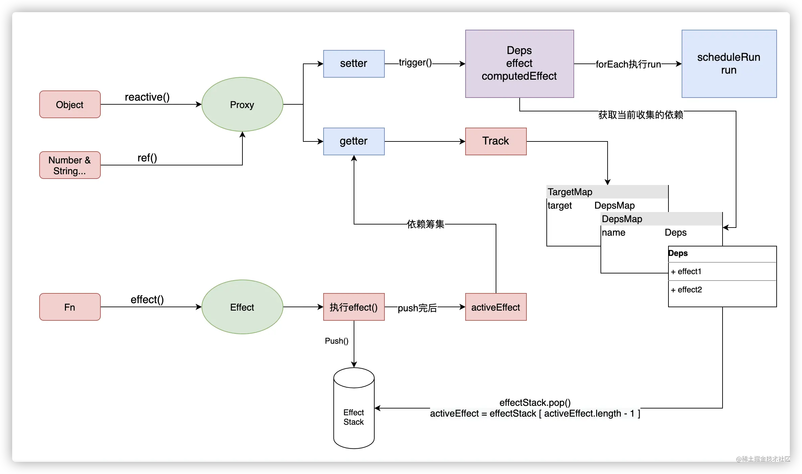
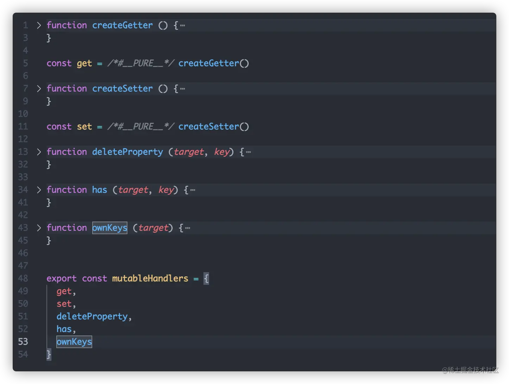
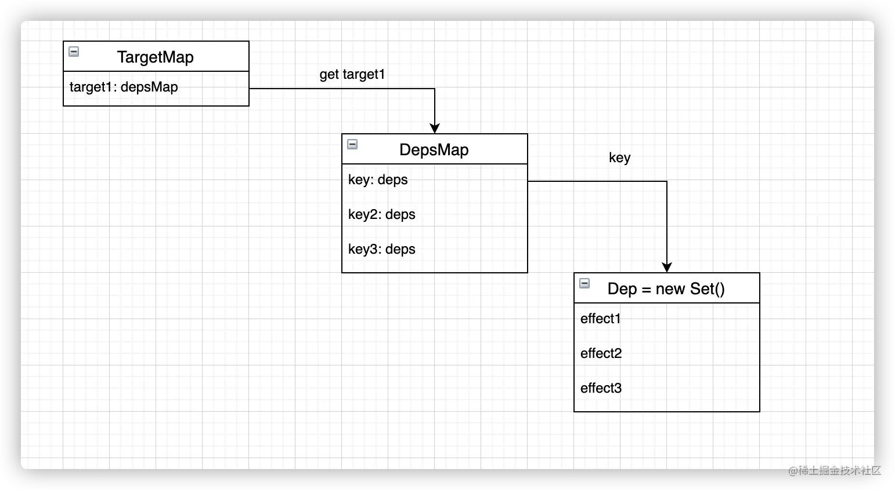

# Vue2的响应式原理

可以先回顾下之前的文章，`Object.defineProperty` 有不少局限性，因此Vue 3 采用了全新的 `Proxy` 对象来实现整个响应式系统基础

# 什么是 Proxy

`Proxy` 是 `ES6` 新增的一个构造函数，用来创建一个 **目标对象的代理对象，拦截对原对象的所有操作；用户可以通过注册相应的拦截方法来实现对象操作时的自定义行为**。

在 Vue 中体现最为明显的一点就是：`Proxy` 代理对象之后不仅可以拦截对象属性的读取、更新、方法调用之外，对整个对象的新增、删除、枚举等也能直接拦截，而 `Object.defineProperty` 只能针对对象的已知属性进行读取和更新的操作拦截。

例如：

```JavaScript
const obj = { name: 'MiyueFE', age: 28 };
const proxyObj = new Proxy(obj, {
  get(target, property) {
    console.log(`Getting ${property} value: ${target[property]}`);
    return target[property];
  },
  set(target, property, value) {
    console.log(`Setting ${property} value: ${value}`);
    target[property] = value;
  },
  deleteProperty(target, property) {
    console.log(`Deleting ${property} property`);
    delete target[property];
  },
});

console.log(proxyObj.name); // Getting name value: MiyueFE, 输出 "MiyueFE"
proxyObj.name = 'MY'; // Setting name value: MY
console.log(proxyObj.name); // Getting name value: MY, 输出 "MY"
delete proxyObj.age; // Deleting age property
console.log(proxyObj.age); // undefined
```

# reactive

`reactive`是`vue3`中用于生成`引用类型`的`api`。

在内部，对传入的对象进行了一个`target`的只读判断，如果你传入的`target`是一个只读代理的话，会直接返回掉。对于正常进行`reactive`的话则是返回了`createReactiveObject`方法的值。

```TypeScript
export function reactive(target: object) {
  // if trying to observe a readonly proxy, return the readonly version.
  if (target && (target as Target)[ReactiveFlags.IS_READONLY]) {
    return target
  }
  return createReactiveObject(
    target,
    false,
    mutableHandlers,
    mutableCollectionHandlers,
    reactiveMap
  )
}
```

## createReactiveObject

在`createReactiveObject`中，做的事情就是为`target`添加一个`proxy`代理。这是其核心，`reactive`最终拿到的是一个`proxy`代理，参考`Proxy`章节的简单事例就可以知道`reactive`是如何进行工作的了，那么在来看下`createReactiveObject`做了一些什么事情。

首先先判断当前`target`的类型，如果不符合要求，直接抛出警告并且返回原来的值。

```TypeScript
if (!isObject(target)) {
    if (__DEV__) {
      console.warn(`value cannot be made reactive: ${String(target)}`)
    }
    return target
  }
```

其次判断当前对象是否已经被代理且并不是只读的，那么本身就是一个代理对象，那么就没有必要再去进行代理了，直接将其当作返回值返回，避免重复代理。

```TypeScript
if (
    target[ReactiveFlags.RAW] &&
    !(isReadonly && target[ReactiveFlags.IS_REACTIVE])
  ) {
    return target
  }
```

而`createReactiveObject`做的最重要的事情就是创建`target`的`proxy`, 并将其放到`Map`中记录。

而比较有意思的是其中对传入的`target`调用了不同的`proxy handle`。

```TypeScript
const proxy = new Proxy(
    target,
    targetType === TargetType.COLLECTION ? collectionHandlers : baseHandlers
  )
  proxyMap.set(target, proxy)
  return proxy
```

## handles的类型

在对象类型中，将`Object`和`Array`与`Map`,`Set`, `WeakMap`,`WeakSet`区分开来了。它们调用的是不同的`Proxy Handle`。

- `baseHandlers.ts`： `Object` & `Array`会调用此文件下的`mutableHandlers`对象作为`Proxy Handle`。

- `collectionHandlers.ts`：`Map`,`Set`, `WeakMap`,`WeakSet`会调用此文件下的`mutableCollectionHandlers`对象作为`Proxy Handle`。

```TypeScript
/**
 * 对象类型判断
 * @lineNumber 41
 */
function targetTypeMap(rawType: string) {
  switch (rawType) {
    case 'Object':
    case 'Array':
      return TargetType.COMMON
    case 'Map':
    case 'Set':
    case 'WeakMap':
    case 'WeakSet':
      return TargetType.COLLECTION
    default:
      return TargetType.INVALID
  }
}
```

会在`new Proxy`的根据返回的`targetType`判断。

```TypeScript
const proxy = new Proxy(
  target,
  targetType === TargetType.COLLECTION ? collectionHandlers : baseHandlers
)
```

> 由于篇幅有限，下文中只举例`mutableHandlers`当作分析的参考。当理解`mutableHandlers`后对于`collectionHandlers`只是时间的问题。

# Proxy Handle

和`Proxy`一样，`mutableHandlers`在内部分别定义`get`, `set`, `deleteProperty`, `has`, `oneKeys`等多个属性参数，完成依赖的收集



在这里，我们用简单的`get`, `set`来进行简单的模拟实例。

```TypeScript
function createGetter () {
    return (target, key, receiver) => {
      const result = Reflect.get(target, key, receiver)
      track(target, key)
      return result
    }
}

const get = /*#__PURE__*/ createGetter()

function createSetter () {
  
  return (target, key, value, receiver) => {
    const oldValue = target[key]
  const result = Reflect.set(target, key, value, receiver)
  if (result && oldValue != value) {
    trigger(target, key)
  }
  return result
  }
}
```

在`get`的时候会进行一个`track`的依赖收集，而`set`的时候则是触发`trigger`的触发机制。在`vue3`，而`trigger`和`track`的话都是在我们`effect.ts`当中声明的，那么接下来就来看看`依赖收集`和`响应触发`究竟做了一些什么吧。

# Effect

对于整个effect模块，将其分为三个部分来去阅读：

- `effect`： 副作用函数

- `track`: 依赖收集，在`proxy`代理数据`get`时调用

- `trigger`: 触发响应，在`proxy`代理数据发生变化的时候调用。

## effect

通过一段实例来看下`effect`的使用，并且了解它主要参数是一个函数。在函数内部会帮你执行一些副作用记录和特性判断。

```TypeScript
effect(() => {
    proxy.user = 1
})
```

来看看`vue`的`effect`干了什么？

在这里，首先判断当前参数`fn`是否是一个`effect`，如果是的话就将`raw`中存放的`fn`进行替换。然后重新进行`createReactiveEffect`生成。

```TypeScript
export function effect<T = any>(
  fn: () => T,
  options: ReactiveEffectOptions = EMPTY_OBJ
): ReactiveEffect<T> {
  if (isEffect(fn)) {
    fn = fn.raw
  }
  const effect = createReactiveEffect(fn, options)
  if (!options.lazy) {
    effect()
  }
  return effect
}
```

在`createReactiveEffect`会将我们`effect`推入到`effectStack`中进行入栈操作，然后用`activeEffect`进行存取当前执行的`effect`，在执行完后会将其进行`出栈`。同时替换`activeEffect`为新的栈顶。

而在`effect`执行的过程中就会触发`proxy handle`然后`track`和`trigger`两个关键的函数。

```TypeScript
function createReactiveEffect<T = any>(
  fn: () => T,
  options: ReactiveEffectOptions
): ReactiveEffect<T> {
  const effect = function reactiveEffect(): unknown {
    if (!effect.active) {
      return options.scheduler ? undefined : fn()
    }
    if (!effectStack.includes(effect)) {
      cleanup(effect)
      try {
        enableTracking()
        effectStack.push(effect)
        activeEffect = effect
        return fn()
      } finally {
        effectStack.pop()
        resetTracking()
        activeEffect = effectStack[effectStack.length - 1]
      }
    }
  } as ReactiveEffect
  effect.id = uid++
  effect.allowRecurse = !!options.allowRecurse
  effect._isEffect = true
  effect.active = true
  effect.raw = fn
  effect.deps = []
  effect.options = options
  return effect
}
```

来看一个简版的`effect`，抛开大多数代码包袱，下面的代码是不是清晰很多。

```TypeScript
function effect(eff) {
  try {
    effectStack.push(eff)
    activeEffect = eff
    return eff(...argsument)
    
  } finally {
    effectStack.pop()
    activeEffect = effectStack[effectStack.length  - 1]
  }
}
```

## track(依赖收集)

在`track`的时候，会进行我们所熟知的依赖收集，会将当前`activeEffect`添加到`dep`里面，而说起这一类的关系。它会有一个一对多对多的关系。



从代码看也非常的清晰，首先我们会有一个一个总的`targetMap`它是一个`WeakMap`，`key`是`target(代理的对象)`, `value`是一个`Map`，称之为`depsMap`，它是用于管理当前`target`中每个`key`的`deps`也就是副作用依赖，也就是以前熟知的`depend`。在`vue3`中是通过`Set`来去实现的。

第一步先凭借当前`target`获取`targetMap`中的`depsMap`，如果不存在就进行`targetMap.set(target, (depsMap = new Map()))`初始化声明，其次就是从`depsMap`中拿当前`key`的`deps`,如果没有找到的话，同样是使用`depsMap.set(key, (dep = new Set()))`进行初始化声明，最后将当前`activeEffect`推入到`deps`,进行依赖收集。

1. 在`targetMap`中找`target`

2. 在`depsMap`中找`key`

3. 将`activeEffect`保存到`dep`里面。

这样的话就会形成一个一对多对多的结构模式，里面存放的是所有被`proxy`劫持的依赖。

```TypeScript
function track(target: object, type: TrackOpTypes, key: unknown) {
  if (!shouldTrack || activeEffect === undefined) {
    return
  }
  let depsMap = targetMap.get(target)
  if (!depsMap) {
    targetMap.set(target, (depsMap = new Map()))
  }
  let dep = depsMap.get(key)
  if (!dep) {
    depsMap.set(key, (dep = new Set()))
  }
  if (!dep.has(activeEffect)) {
    dep.add(activeEffect)
    activeEffect.deps.push(dep)
    if (__DEV__ && activeEffect.options.onTrack) {
      activeEffect.options.onTrack({
        effect: activeEffect,
        target,
        type,
        key
      })
    }
  }
}
```

## trigger(响应触发)

在`trigger`的时候，做的事情其实就是触发当前响应依赖的执行。

首先，需要获取当前`key`下所有渠道的`deps`，所以会看到有一个`effects`和`add`函数, 做的事情非常的简单，就是来判断当前传入的`depsMap`的属性是否需要添加到`effects`里面，在这里的条件就是`effect`不能是当前的`activeEffect`和`effect.allowRecurse`，来确保当前`set key`的依赖都进行执行。

```TypeScript
const effects = new Set<ReactiveEffect>()
  const add = (effectsToAdd: Set<ReactiveEffect> | undefined) => {
    if (effectsToAdd) {
      effectsToAdd.forEach(effect => {
        if (effect !== activeEffect || effect.allowRecurse) {
          effects.add(effect)
        }
      })
    }
  }
```

下面下面熟知的场景就是判断当前传入的一些变化行为，最常见的就是在`trigger`中会传递的`TriggerOpTypes`行为，然后执行`add`方法将其将符合条件的`effect`添加到`effects`当中去，在这里`@vue/reactivity`做了很多数据就变异上的行为，如`length`变化。

然后根据不同的`TriggerOpTypes`进行`depsMap`的数据取出，最后放入`effects`。随后通过`run`方法将当前的`effect`执行，通过`effects.forEach(run)`进行执行。

```TypeScript
if (type === TriggerOpTypes.CLEAR) {
    // collection being cleared
    // trigger all effects for target
    depsMap.forEach(add)
  } else if (key === 'length' && isArray(target)) {
    depsMap.forEach((dep, key) => {
      if (key === 'length' || key >= (newValue as number)) {
        add(dep)
      }
    })
  } else {
    // schedule runs for SET | ADD | DELETE
    if (key !== void 0) {
      add(depsMap.get(key))
    }

    // also run for iteration key on ADD | DELETE | Map.SET
    switch (type) {
      case TriggerOpTypes.ADD:
        if (!isArray(target)) {
          add(depsMap.get(ITERATE_KEY))
          if (isMap(target)) {
            add(depsMap.get(MAP_KEY_ITERATE_KEY))
          }
        } else if (isIntegerKey(key)) {
          // new index added to array -> length changes
          add(depsMap.get('length'))
        }
        break
      case TriggerOpTypes.DELETE:
        if (!isArray(target)) {
          add(depsMap.get(ITERATE_KEY))
          if (isMap(target)) {
            add(depsMap.get(MAP_KEY_ITERATE_KEY))
          }
        }
        break
      case TriggerOpTypes.SET:
        if (isMap(target)) {
          add(depsMap.get(ITERATE_KEY))
        }
        break
    }
  }
```

而`run`又做了什么呢？

首先就是判断当前`effect`中`options`下有没有`scheduler`，如果有的话就使用`schedule`来处理执行，反之直接直接执行`effect()`。

```JavaScript
if (effect.options.scheduler) {
      effect.options.scheduler(effect)
    } else {
      effect()
    }
```

将其缩短一点看处理逻辑，其实就是从`targetMap`中拿对应`key`的依赖。

```JavaScript
const depsMap = targetMap.get(target)
  if (!depsMap) {
    return
  }
  const dep = depsMap.get(key)
  if (dep) {
    dep.forEach((effect) => {
      effect()
    })
  }
```

# vue2和vue3的对比

## vue2

Vue2 是通过 Object.defineProperty 将对象的属性转换成 getter/setter 的形式来进行监听它们的变化，当读取属性值的时候会触发 getter 进行依赖收集，当设置对象属性值的时候会触发 setter 进行向相关依赖发送通知，从而进行相关操作。

由于 Object.defineProperty 只对属性 key 进行监听，无法对引用对象进行监听，所以在 Vue2 中创建一个了 Observer 类对整个对象的依赖进行管理，当对响应式对象进行新增或者删除则由响应式对象中的 dep 通知相关依赖进行更新操作。

Object.defineProperty 也可以实现对数组的监听的，但因为性能的原因 Vue2 放弃了这种方案，改由重写数组原型对象上的 7 个能操作数组内容的变更的方法，从而实现对数组的响应式监听。

## vue3

Vue3 则是通过 Proxy 对数据实现 getter/setter 代理，从而实现响应式数据，然后在副作用函数中读取响应式数据的时候，就会触发 Proxy 的 getter，在 getter 里面把对当前的副作用函数保存起来，将来对应响应式数据发生更改的话，则把之前保存起来的副作用函数取出来执行。

Vue3 对数组实现代理时，用于代理普通对象的大部分代码可以继续使用，但由于对数组的操作与对普通对象的操作存在很多的不同，那么也需要对这些不同的操作实现正确的响应式联系或触发响应。这就需要对数组原型上的一些方法进行重写。

比如通过索引为数组设置新的元素，可能会隐式地修改数组的 length 属性的值。同时如果修改数组的 length 属性的值，也可能会间接影响数组中的已有元素。另外用户通过 includes、indexOf 以及 lastIndexOf 等对数组元素进行查找时，可能是使用代理对象进行查找，也有可能使用原始值进行查找，所以我们就需要重写这些数组的查找方法，从而实现用户的需求。原理很简单，当用户使用这些方法查找元素时，先去响应式对象中查找，如果没找到，则再去原始值中查找。

另外如果使用 push、pop、shift、unshift、splice 这些方法操作响应式数组对象时会间接读取和设置数组的 length 属性，所以我们也需要对这些数组的原型方法进行重新，让当使用这些方法间接读取 length 属性时禁止进行依赖追踪，这样就可以断开 length 属性与副作用函数之间的响应式联系了。

# 参考

- [Vue2与Vue3响应式原理与依赖收集详解](https://juejin.cn/post/7202454684657107005)


