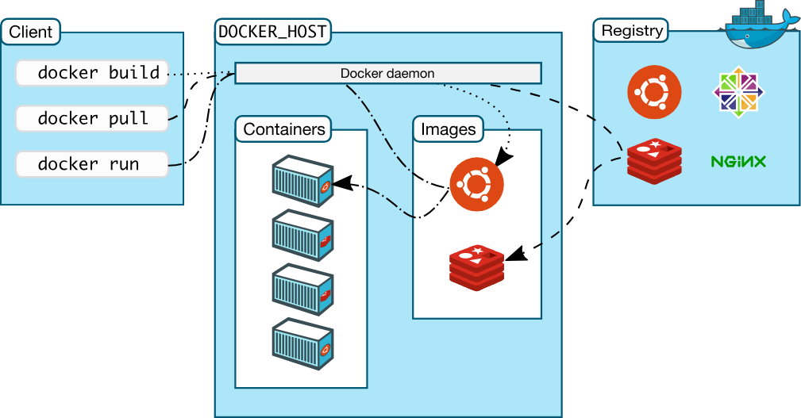
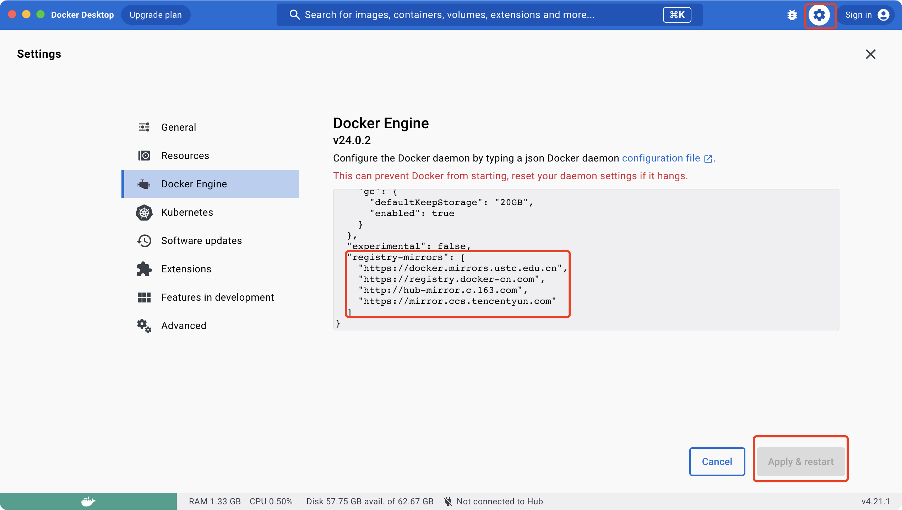

# 1. 术语

docker的架构如下



从图中可以看出几个组成部分

- docker client: 即 docker 命令行工具

- docker host: 宿主机，docker daemon 的运行环境服务器

- docker daemon: docker 的守护进程，docker client 通过命令行与 docker daemon 交互

- container: 最小型的一个操作系统环境，可以对各种服务以及应用容器化

- image: 镜像，可以理解为一个容器的模板配置，通过一个镜像可以启动多个容器

- registry: 镜像仓库，存储大量镜像，可以从镜像仓库拉取和推送镜像

# 2. 下载docker

- 到 [docker官网](https://www.docker.com/) 下载安装包

- mac 使用 brew 安装

```Shell
# 安装 brew
bin/zsh -c "$(curl -fsSL https://gitee.com/cunkai/HomebrewCN/raw/master/Homebrew.sh)"

# 安装 docker
brew install docker

# 查看 docker
docker --version
```

- centos 使用yum安装

```Shell
# 安装依赖
yum install -y yum-utils device-mapper-persistent-data lvm2

# 安装 docker 官方的镜像源
yum-config-manager --add-repo https://download.docker.com/linux/centos/docker-ce.repo

# 如果在国内，安装阿里云的镜像
yum-config-manager --add-repo http://mirrors.aliyun.com/docker-ce/linux/centos/docker-ce.repo

# 安装 docker
yum install -y docker-ce
```

# 3. 设置国内镜像源

- 使用 docker-destop编辑



- 编辑配置文件daemon.json，添加源地址

```JSON
{
  "registry-mirrors": [
    "https://docker.mirrors.ustc.edu.cn",
    "https://registry.docker-cn.com",
    "http://hub-mirror.c.163.com",
    "https://mirror.ccs.tencentyun.com"
  ]
}
```

# 4. 查看配置

```Shell
docker info

# 出现一下字段代表配置成功
# Registry Mirrors:
#  https://docker.mirrors.ustc.edu.cn/
#  https://registry.docker-cn.com/
#  http://hub-mirror.c.163.com/
#  https://mirror.ccs.tencentyun.com/
```

# 5. 常见命令

## 5.1. Dockerfile命令

建议阅读官方的 [dockerfile-best-practices](https://docs.docker.com/develop/develop-images/dockerfile_best-practices/)

1. FROM

基于一个就有的镜像，格式如下

```Dockerfile
FROM <image> [AS <name>]

# 在多阶段构建时会用到
FROM <image>[:<tag>] [AS <name>]
```

1. WORKDIR

设置为工作目录

```Dockerfile
WORKDIR <path>
```

1. ADD, COPY

两者都可以把目录，或者 url 地址文件加入到镜像的文件系统中(ADD 可以解压 tar.gz 文件，COPY原封不动复制过去，官方推荐使用COPY，因为语义更简单)

```Dockerfile
ADD [--chown=<user>:<group>] <src>... <dest>
```

1. RUN

执行命令，由于 ufs 的文件系统，它会在当前镜像的顶层新增一层

```Dockerfile
RUN <command>
```

1. CMD

指定容器如何启动

**一个 Dockerfile 中只允许有一个 CMD**

```Dockerfile
# exec form, this is the preferred form
CMD ["executable","param1","param2"] 

# as default parameters to ENTRYPOINT
CMD ["param1","param2"]

# shell form
CMD command param1 param2
```

1. ARG，ENV

`ARG` 和 `ENV` 的效果一样，都是设置**环境变量**。不同的是，`ARG` 所设置是`构建时`的环境变量，在将来容器`运行时`是不会存在这些环境变量的。

> ⚠️ 注意，尽量不要在 `ARG` 放置敏感信息，因为 `docker history` 可以看到构建的过程

```Dockerfile
ARG NGINX_VERSION=1.22.1

ADD nginx-${NGINX_VERSION}.tar.gz /

ENV PORT 3000
```

## 5.2 Docker CLI命令

```Shell
# 开启docker服务
service docker start
# 启动 docker 后台服务
systemctl start docker
# 重启docker守护进程
systemctl daemon-reload
# 重启docker服务
systemctl restart docker

# docker拉取镜像
docker pull 镜像别名:版本号
# 生成镜像, --node-cache 不使用缓存
docker build --rm --no-cache=true  -t node-server .
# 删除镜像
docker rmi 镜像id
# 删除镜像 例：docker rmi button-api/v2
docker rmi REPOSITORY/TAR
# 查看镜像列表
docker images

# 查看容器列表,不加-a查看正在运行的，加上-a查看所有容器
docker ps -a
# 删除容器
docker rm 容器ID/容器别名
# 启动容器
#（-d 后台运行, --name 容器别名, -p 宿主机端口:容器端口, --network 桥接网络别名, 最后是镜像名称:镜像版本）
docker run -d  --restart always --name jianghu-server -p 3006:3006 node-server:1.0.0
# 关闭一个已启动容器 
docker stop 容器ID/容器别名
# 启动一个关闭的容器 
docker start 容器ID/容器别名
# 查看一个容器的详情 
docker inspect 容器ID/容器别名
# 进入容器内部
docker exec -it 容器ID/容器别名 /bin/bash

# 创建一个桥接模式的网络，local-net为网络别名
docker network create -d bridge local-net
# 查看网络配置详情
docker network inspect local-net

# 配置镜像tag
docker tag vue-bpmn-image:1.0.0 192.168.1.98/docker-steps/vue-bpmn-image:1.0.0
# 发布镜像到远程服务器(需要先打tag)
 docker push 192.168.1.98/docker-steps/vue-bpmn-image:1.0.0
```

# 6. 优化镜像大小

## 6.1 选择镜基础镜像

在Node.js中，有许多变体镜像发行版，相比官方镜像，体积更加精简。这些标签包括：

- Bullseye：提供 Debian发行版，以减少镜像需要安装的软件包数量，从而减小自定义镜像的整体大小。

- Alpine：任何 Node.js Alpine 变迁均源自 Alpine Linux，可提供约 5MB 的较小基础镜像发行版。

- Slim：Slim 标签值包括运行 Node.js 应用程序所需的基本软件包，通过消除不必要的软件包有效减小镜像的大小

```Dockerfile
FROM node:16-alpine
WORKDIR /app
COPY package*.json ./
RUN npm install
COPY . .
RUN npm run build
EXPOSE 4000
CMD npm start
```

## 6.2 使用.dockerignore 来最小化和精简Docker镜像

在创建上述镜像时， COPY. . 命令会复制项目目录的所有文件和文件夹。但是 RUN npm install 生成的 node_modules文件夹，以及RUN npm run build 生成的构建文件夹是没有必要复制到镜像。

可以在项目根目录创建 .dockerignore 文件过滤这些文件夹

```Plain Text
node_modules
Dockerfile
build
dist
```

## 6.3 减少Docker镜像层

Dockerfile 中的每一条指令都会逐步创建一个新层，层数越多相对体积便会越大。

比如下面的示例：

```Dockerfile
FROM node:16-alpine
WORKDIR /app
COPY package*.json ./
COPY . .
RUN npm install
RUN npm run build
RUN rm -rf node_modules
RUN npm install --production
EXPOSE 4000
CMD npm start
```

可以将多个 RUN 合并在一起，这样只会创建一个图层：

```Dockerfile
FROM node:16-alpine
WORKDIR /app
COPY package*.json ./
COPY . .
RUN npm install && \
    npm run build && \
    rm -rf node_modules && \
    npm install --production
EXPOSE 4000
CMD npm start
```

## 6.4 多阶段构建

Docker 允许将多个构建步骤整合在一个 Dockerfile 文件中，这个构建步骤之间可以存在依赖关系，也可以进行文件传递，还可以更好地利用缓存。

```Dockerfile
# 🔴 阶段 1，安装依赖
FROM node:16-alpine AS base
WORKDIR /app
 
# 单独分离 package.json，是为了安装依赖可最大限度利用缓存
# 每次 docker build 的时候，只会从变化的层开始重新构建，没变的层会直接复用。
COPY package.json pnpm-lock.yaml /app/
RUN pnpm install
 
COPY . /app
# 🔴 阶段 2，构建
FROM base as build
RUN pnpm run build
 
# 🔴 阶段 3，部署nginx
# 选择更小体积的基础镜像
FROM nginx:alpine as deply
# 通过 --from 从构建阶段复制文件（from后面也可以写官方镜像的名称，比如可以拷贝nginx:latest官方镜像到自己的镜像）
COPY --from=build /app/dist /usr/share/nginx/html
```

方案1 还是有很多缺陷，比如 package.json 只要变动一个字节，都会导致 pnpm 重新安装。能不能在运行 build 的时候挂载缓存目录进去？把 `node_modules` 或者 `pnpm store` 缓存下来？

Docker build 确实支持[挂载](https://link.juejin.cn?target=https%3A%2F%2Fdocs.docker.com%2Fbuild%2Fguide%2Fmounts%2F)([BuildKit](https://link.juejin.cn?target=https%3A%2F%2Fyeasy.gitbook.io%2Fdocker_practice%2Fbuildx%2Fbuildkit), 需要 Docker 18.09+)。以下是缓存 pnpm 的示例(来自官方[文档](https://link.juejin.cn?target=https%3A%2F%2Fpnpm.io%2Fzh%2Fdocker))：

```Dockerfile
# 🔴 阶段 1，安装依赖构建
FROM node:16-alpine AS builder
WORKDIR /app

# 拷贝依赖声明
ENV PNPM_HOME="/pnpm"
ENV PATH="$PNPM_HOME:$PATH"
COPY package.json pnpm-lock.yaml /app/
# 挂载缓存
RUN --mount=type=cache,id=pnpm,target=/pnpm/store pnpm install

COPY . /app
# 🔴 阶段 2，构建
FROM base as build
RUN pnpm run build
 
# 🔴 阶段 2，部署nginx
# 选择更小体积的基础镜像
FROM nginx:alpine as deply
# 通过 --from 从构建阶段复制文件（from后面也可以写官方镜像的名称，比如可以拷贝nginx:latest官方镜像到自己的镜像）
COPY --from=build app/dist /usr/share/nginx/html
```

> 💡你也可以通过设置 `DOCKER_BUILDKIT=1` 环境变量来启用 `BuildKit`

`RUN —mount` 参数可以指定要挂载的目录，对应的缓存会存储在`宿主机器`中。这样就解决了 Docker 构建过程的外部缓存问题。

同理其他的缓存，比如 vite、Webpack，也是通过 `—mount` 挂载。一个 `RUN` 支持指定多个 `—mount`

> ⚠️ 因为采用挂载形式，这种跨设备会导致 `pnpm` 回退到拷贝模式(pnpm store → node_modules)，而不是链接模式，所以安装性能会有所损耗。

> 如果是 npm 通常需要缓存 `~/.npm` 目录

## 6.5 使用工具缩小镜像大小

- DockerSlim 可以删除不必要的文件和依赖项，并创建值包括必要组件的镜像；

- Dive可以分析你的镜像层元数据。然后识别未使用的依赖项、重复文件和其他你可以删除的低效内容；

- Docker-squash可以将多个镜像层压缩成单个层。

# 7. 容器编排工具

当容器数量很多后，可以通过一下三种常用的编排工具进行管理

## 7.1. Docker Compose

## 7.2. Docker Swarm

## 7.3. Kubernetes

# 8. 参考

- [官网文档](https://docs.docker.com/reference/)

- [docker_practice](https://github.com/yeasy/docker_practice)

- [使用 Docker 实现前端应用的标准化构建、部署和运行](https://juejin.cn/post/7269668219488354361)

- [掌握这 5 个技巧，让你的 Dockerfile 像个大师！](https://juejin.cn/post/7248145094600900669)

- [Docker化一个前端基础开发环境：简洁高效的选择](https://juejin.cn/post/7264403008163201081)


